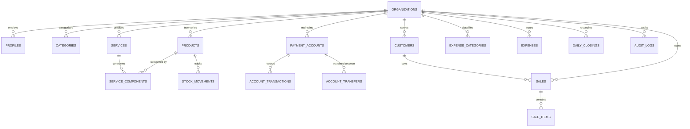

# Yaqoob Enterprises Manager - Database Architecture & Schema

## 1. Dual-Database Architecture

The data architecture operates on a **Local-First, Cloud-Synchronized** paradigm:

1. **Local SQLite (`yaqoob_manager.db`):** The primary source of truth for the local desktop instance. All UI operations interact directly with this embedded database. It runs with Write-Ahead Logging (`PRAGMA journal_mode = WAL;`) and synchronous normal mode for zero-latency POS performance and crash durability.
2. **Cloud PostgreSQL 15 (Supabase):** The shared multi-tenant synchronization target. Enforces Row-Level Security (RLS) policies, foreign key integrity, and automated user onboarding.



---

## 2. Local SQLite Schema & Migrations

### `schema_migrations`
Tracks applied migration versions locally:
```sql
CREATE TABLE IF NOT EXISTS schema_migrations (
  version INTEGER PRIMARY KEY,
  name TEXT NOT NULL,
  applied_at TEXT NOT NULL
);
```

### `sync_queue`
Durable queue of local mutations awaiting cloud sync:
```sql
CREATE TABLE IF NOT EXISTS sync_queue (
  id TEXT PRIMARY KEY,
  table_name TEXT NOT NULL,
  record_id TEXT NOT NULL,
  operation TEXT NOT NULL, -- 'INSERT' | 'UPDATE' | 'DELETE'
  payload TEXT NOT NULL,   -- JSON serialized data
  attempts INTEGER DEFAULT 0,
  status TEXT DEFAULT 'pending', -- 'pending' | 'failed' | 'synced'
  last_error TEXT,
  created_at TEXT NOT NULL,
  updated_at TEXT NOT NULL
);
CREATE INDEX IF NOT EXISTS idx_sync_queue_status ON sync_queue(status, created_at);
```

### `sync_logs`
Inspection log of synchronization executions:
```sql
CREATE TABLE IF NOT EXISTS sync_logs (
  id TEXT PRIMARY KEY,
  sync_type TEXT NOT NULL,
  status TEXT NOT NULL,
  records_pushed INTEGER DEFAULT 0,
  records_pulled INTEGER DEFAULT 0,
  error_message TEXT,
  created_at TEXT NOT NULL
);
```

### Core Business Tables
All core tables include `sync_status TEXT DEFAULT 'synced'` to track local state.
- **`organizations`**: `id`, `name`, `owner_name`, `currency`, `currency_symbol`, `country`, `timezone`, `business_category`, `phone`, `email`, `address`, `tax_rate`, `tax_enabled`, `receipt_footer`, `invoice_prefix`, `next_invoice_number`, `sync_status`, `created_at`, `updated_at`.
- **`profiles`**: `id`, `email`, `full_name`, `role` (`OWNER`, `MANAGER`, `CASHIER`), `organization_id`, `is_active`, `sync_status`, `created_at`, `updated_at`.
- **`categories`**: `id`, `organization_id`, `name`, `type` (`PRODUCT`, `SERVICE`, `BOTH`), `color`, `sync_status`, `created_at`, `updated_at`.
- **`products`**: `id`, `organization_id`, `name`, `sku`, `category_id`, `category_name`, `unit`, `purchase_price`, `selling_price`, `opening_stock`, `current_stock`, `min_stock_threshold`, `track_stock`, `average_cost`, `stock_value`, `supplier`, `notes`, `sync_status`, `created_at`, `updated_at`.
- **`services`**: `id`, `organization_id`, `name`, `sku`, `category_id`, `category_name`, `selling_price`, `estimated_cost`, `is_active`, `notes`, `sync_status`, `created_at`, `updated_at`.
- **`service_components`**: `id`, `organization_id`, `service_id`, `product_id`, `product_name`, `quantity_consumed`, `unit`, `sync_status`, `created_at`.
- **`stock_movements`**: `id`, `organization_id`, `product_id`, `product_name`, `movement_type` (`PURCHASE`, `SALE`, `ADJUSTMENT_INCREASE`, `ADJUSTMENT_DECREASE`, `CUSTOMER_RETURN`, `SUPPLIER_RETURN`, `DAMAGE_WASTAGE`), `quantity`, `unit_cost`, `total_cost`, `reference_id`, `reference_type`, `notes`, `created_by`, `sync_status`, `created_at`.
- **`payment_accounts`**: `id`, `organization_id`, `name`, `type` (`CASH`, `BANK`, `DIGITAL_WALLET`), `account_number`, `current_balance`, `opening_balance`, `is_active`, `is_default`, `sync_status`, `created_at`, `updated_at`.
- **`account_transfers`**: `id`, `organization_id`, `from_account_id`, `from_account_name`, `to_account_id`, `to_account_name`, `amount`, `date`, `notes`, `created_by`, `sync_status`, `created_at`.
- **`account_transactions`**: `id`, `organization_id`, `account_id`, `account_name`, `type` (`INCOME`, `EXPENSE`, `TRANSFER_IN`, `TRANSFER_OUT`, `ADJUSTMENT`), `amount`, `balance_after`, `reference_type`, `reference_id`, `description`, `date`, `sync_status`, `created_at`.
- **`sales`**: `id`, `organization_id`, `invoice_number`, `customer_id`, `customer_name`, `customer_phone`, `cashier_id`, `cashier_name`, `subtotal`, `discount`, `tax_amount`, `grand_total`, `amount_paid`, `change_due`, `payment_method`, `split_payments`, `total_cogs`, `gross_profit`, `status` (`COMPLETED`, `VOIDED`, `REFUNDED`), `notes`, `void_reason`, `voided_by`, `voided_at`, `sync_status`, `created_at`.
- **`sale_items`**: `id`, `organization_id`, `sale_id`, `item_type`, `item_id`, `item_name`, `sku`, `unit`, `quantity`, `unit_price`, `unit_cost`, `discount`, `subtotal`, `total`, `cogs`, `gross_profit`, `sync_status`, `created_at`.
- **`customers`**: `id`, `organization_id`, `name`, `phone`, `email`, `address`, `notes`, `total_purchases`, `last_purchase_date`, `outstanding_balance`, `sync_status`, `created_at`, `updated_at`.
- **`expense_categories`**: `id`, `organization_id`, `name`, `description`, `is_active`, `sync_status`, `created_at`.
- **`expenses`**: `id`, `organization_id`, `category_id`, `category_name`, `amount`, `account_id`, `account_name`, `description`, `reference_number`, `date`, `notes`, `entered_by`, `status` (`ACTIVE`, `VOIDED`), `sync_status`, `created_at`.
- **`daily_closings`**: `id`, `organization_id`, `closing_date`, `opening_cash`, `cash_sales`, `cash_expenses`, `cash_transfers_in`, `cash_transfers_out`, `expected_cash`, `actual_cash`, `difference`, `notes`, `closed_by`, `closed_at`, `sync_status`, `created_at`.
- **`audit_logs`**: `id`, `organization_id`, `user_id`, `user_name`, `action`, `entity`, `entity_id`, `details`, `metadata`, `sync_status`, `created_at`.

---

## 3. Supabase PostgreSQL Migrations

### Migration `20260918000000_initial_schema.sql`
Creates the PostgreSQL tables, primary keys, foreign key cascades, and initial RLS policies.

### Migration `20260919000000_harden_rls_and_auth.sql`
Harden multi-tenant RLS policies and automates owner signup without leaking administrative permissions:
1. **Helper Function `current_user_org_id()`**: Efficient security definer function returning the authenticated user's `organization_id`.
2. **Comprehensive RLS**: Covers all tables (`categories`, `expense_categories`, `service_components`, `profiles`, `organization_members`) ensuring no cross-tenant leaks.
3. **Automated Provisioning Trigger (`handle_new_user_registration`)**:
   When a new user signs up in `auth.users`, a database trigger creates an `organizations` record, adds the user to `profiles` with role `'OWNER'`, and provisions initial categories and payment accounts—all securely on PostgreSQL without exposing the `service_role` key to the desktop app.
