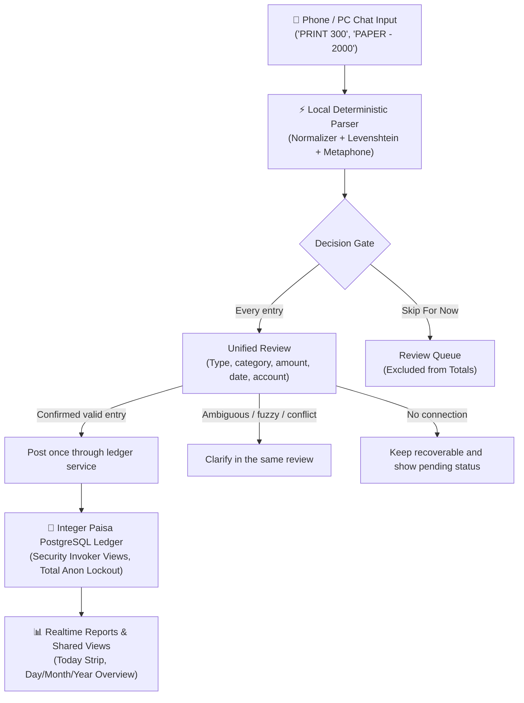

# Shop Pro

> **Offline-first business management for shops and service businesses**  
> Manage transactions, accounts, and inventory across phones, tablets, and computers.  
> **Cost: Rs 0 / month** (100% Free Tiers, Zero Paid APIs, Zero AI Token Dependencies).

[](https://www.typescriptlang.org/)
[](https://react.dev/)
[](https://supabase.com/)
[](https://vitest.dev/)
[](https://web.dev/progressive-web-apps/)

---

## 🌟 Product Architecture: "Simple Input -> Smart Processing -> Organized Backend -> Powerful Reports"

Shop Pro replaces handwritten registers with a fast business ledger that works across phones, tablets, and computers.



---

## 🚀 Key Features

### 1. Deterministic Local Parser (Zero Paid APIs, Zero AI Latency)
- **Instant Processing:** Split multi-line -> normalize (case, spaces, currency symbols, commas, `/-`, `=/-`) -> tokenize (amount, sign, date chips) -> match category -> classify.
- **Strict Safety Policies:**
  - Minus sign (`-`) = Expense.
  - Every text entry opens a single review where the user confirms its classification, date, amount, and active payment account before posting.
  - **Fuzzy tolerance scaled by word length:** $\le 3$ characters: exact match only; $4-6$ characters: max 1 edit; $> 6$ characters: max 2 edits.
  - **Urdu/English Phonetic matching:** Metaphone/Soundex maps typos like `LMNYON` $\to$ `Lamination`, `PRNT` $\to$ `Print`.
  - **Mandatory Clarification Prompts:**
    - Bare numbers (e.g. `10000` $\to$ Income / Expense / Capital / Withdrawal / Adjustment).
    - Sign vs Category conflicts (e.g. `PAPER 2000` typed without minus sign).
    - Unknown words (e.g. `GLUE 120`).
    - Ambiguous dates: `kal` is strictly flagged and asked (can mean yesterday or tomorrow).
    - Unusual amounts (per-category limit, default Rs 50,000).
    - Possible duplicates within 3 minutes across users.
  - **Capital, Withdrawal, and Adjustment:** ALWAYS require explicit confirmation cards.
  - **Multi-Line Messages:** Single batch preview card with blocking gates on flagged lines.
  - **Backdating:** Defaults to today in `Asia/Karachi`; supports "yesterday" or explicit date chips (`YYYY-MM-DD`).
  - **Review Queue:** "Skip for now" parks entries in the Review queue, strictly excluded from ledger totals.

Existing unposted drafts remain available in the ledger feed for account assignment. Voiding, restoring, and editing require a connection; failed attempts do not change local account balances or report success.

### 2. Bulletproof Integer Paisa PostgreSQL Foundation
- **No Float Rounding Errors:** All monetary amounts stored as integer paisa ($1\text{ Rupee} = 100\text{ paisa}$).
- **Immutable Audit Logging:** System trigger runs with `SECURITY DEFINER` and fixed `search_path`. Clients cannot manually insert, update, or delete audit logs.
- **Total Anon Lockout:** All direct access revoked from `anon`. Unauthenticated requests read 0 rows.
- **Shop Membership RLS:** Every table and view enforces active membership in `shop_members` (`is_active_shop_member()`).
- **Database Trigger Protections:**
  - `prevent_hard_delete`: Hard DELETE is blocked in SQL.
  - `prevent_truncate`: TRUNCATE is blocked in SQL.
  - `chk_void_requires_reason`: Voids require mandatory reason, user ID, and timestamp.
  - `prevent_stale_edit`: Optimistic concurrency prevents race conditions using `updated_at`.
  - `prevent_future_business_date`: Server database rejects future business dates and clock drift.
- **Shared SQL Views (`security_invoker = true`):**
  - `view_daily_summary`: Daily income, expense, net profit, capital in, withdrawals, adjustments.
  - `view_monthly_summary`: Monthly and annual financial aggregations.
  - `view_category_breakdown`: Category-level volume and amount breakdowns.

### 3. Multi-Device Concurrency & Offline Resilience
- **Persistent IndexedDB Queue:** Mutations capture exact device entry time and client-side `idempotency_key`.
- **Automatic Reconnection Flush:** Retries are idempotent (`ON CONFLICT (idempotency_key) DO NOTHING`) and never duplicate entries.
- **Cross-Device Realtime:** Supabase Realtime automatically syncs transactions across the 3 brothers within milliseconds.

---

## 🛠️ Environment Variables

Create a `.env` file in the project root:

```env
# Public Supabase Client Config (Client-Safe Anon Key)
VITE_SUPABASE_URL=https://your-project-id.supabase.co
VITE_SUPABASE_ANON_KEY=eyJhbGciOiJIUzI1NiIsInR5cCI6IkpXVCJ9...
```

> [!CAUTION]
> **NEVER** expose the Supabase `service_role` key in client code, the `.env` file, or public repositories. It must ONLY live in GitHub Actions CI secrets.

---

## 💻 Local Development & Testing

```bash
# 1. Install dependencies
npm install

# 2. Run the complete automated test suite (145 tests including 483-message corpus & WASM Postgres)
npm run test

# 3. Start local development server
npm run dev

# 4. Production build check
npm run build
```

---

## 👥 How to Add or Remove a User

Access to the ledger is governed strictly by the `shop_members` table in PostgreSQL:

### To Add an Authorized Brother:
1. In the Supabase Dashboard, create the user account under **Authentication -> Users** with their email and password.
2. Note their generated UUID.
3. In SQL Editor, add them to `shop_members`:
```sql
INSERT INTO public.shop_members (user_id, full_name, email)
VALUES ('<USER-UUID>', 'Brother Name', 'brother@yaqoob.shop');
```

### To Remove or Deactivate a User:
```sql
DELETE FROM public.shop_members WHERE email = 'brother@yaqoob.shop';
```
*Once removed from `shop_members`, RLS policies immediately block all reads and writes, even if their password is still valid.*

---

## 📦 Automated Backups & Restoration

### Daily GitHub Actions Workflow (`.github/workflows/ci_and_backup.yml`)
- Runs every night at 23:00 UTC (04:00 AM PKT).
- Paginates beyond 1,000 rows to extract every single transaction.
- Verifies extracted row count matches exact live database count.
- Uploads encrypted JSON archive to GitHub Artifacts (90-day retention).

### Manual Backup Run:
```bash
SUPABASE_URL="https://your-id.supabase.co" SUPABASE_SERVICE_ROLE_KEY="secret" npx tsx scripts/backup_database.ts
```

### Restoration into Clean / Empty Database:
```bash
SUPABASE_URL="https://your-id.supabase.co" SUPABASE_SERVICE_ROLE_KEY="secret" npx tsx scripts/restore_database.ts backups/yaqoob_ledger_backup_XXXX.json
```

---

## 🛡️ Free-Tier Risks & Mitigations

| Free-Tier Risk | Real-World Impact | How Yaqoob Ledger Mitigates It |
| :--- | :--- | :--- |
| **Supabase Auto-Pausing** | Inactive projects pause after 7 days on free tier | Daily GitHub Actions cron workflow pings and queries the database every 24 hours, preventing auto-pause. |
| **No Built-in Backups** | Free tier lacks Point-in-Time Recovery (PITR) | Automated daily paginated backup script exports full archives to GitHub with checksum verification. |
| **GitHub Actions Cron Inactivity** | GitHub disables scheduled workflows if repository has no commits for 60 days | Active commits or periodic manual `workflow_dispatch` triggers keep workflows permanently running. |
| **Flaky Cellular Connectivity** | Internet disconnects during peak counter hours | Local IndexedDB queue buffers transactions offline with idempotency keys; flushes silently on reconnect. |

---

## 🌐 Free HTTPS Hosting & PWA Installation

To install as an app on phone and PC, the ledger must be hosted on an HTTPS domain.
Recommended simplest free HTTPS host: **Cloudflare Pages** or **Vercel / Netlify Free Tier**.
See `FINAL_REPORT.md` for step-by-step instructions.
